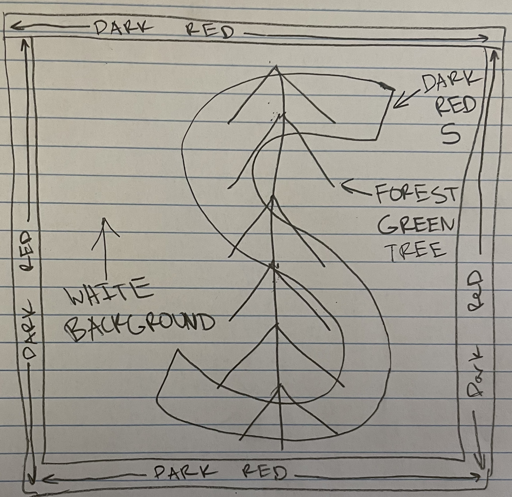

# Unit 1 - Asphalt Art

## Introduction

Cities use asphalt art to improve public safety, inspire their residents and visitors, and brighten communities. Your goal is to create asphalt art to revitalize The Neighborhood and bring the community together with the help of the Painter.

## Requirements

Use your knowledge of object-oriented programming, algorithms, the problem solving process, and decomposition strategies to create asphalt art:
- **Create a new subclass** – Create at least one new subclass of the PainterPlus class that is used for a component of the asphalt art design.
- **Plan an algorithm** – Use the problem solving process and decomposition strategies to plan an algorithm that incorporates a combination of sequencing, selection, and/or iteration.
- **Write a method** – Write at least one method in a PainterPlus subclass that contributes to a component of the asphalt art design.
- **Document your code** – Use comments to explain the purpose of the methods and code segments.

## Notes: Neighborhood & Painter Class

This project was created on Code.org's JavaLab platform using the built in Neighborhood GUI output. To test and edit this project you must build in Code.org's JavaLab with the Neighborhood GUI enabled. For reference to the Painter class documentation, [you can read more here.](https://studio.code.org/docs/ide/javalab/classes/Painter)

## Output:

 

## Reflection

1. Describe your project.

   - This project takes the logo for Stanford University and depicts it on a 16x16 grid. Due to the fact that it is a grid made of squares, the logo is pixelated, but still remains the same as it initially is. The logo itself is a dark red S with a forest green tree on top of it. The tree represents Stanford's mascot. All of this is also on a white background due to the fact that Stanford's colors are dark red, white, and green. There is also a slight detail that many people do not take note of, which is the red color on the edge of the background on three sides. This represents the look of a barn, as they are red and have two walls and a ceiling. The reason why a barn was placed is due to the fact that Stanford is often referred to as "The Farm" and farms most always have barns.

2. What are two things about your project that you are proud of?

   - I am very proud of how the red S turned out. This is due to the fact that it took some time to make sure that it was symmetrical and there were no edges to go too far or are too small.
   - I am also proud of the green tree that was placed on top of the S. This is because it had to match up perfectly with the S since it matches up exactly in the actual logo. This took some time to make sure everything was lined up exactly as needed be.

3. Describe something you would improve or do differently if you had an opportunity to change something about your project.

   - Something I would do differently would be to use less code in the NeighborhoodRunner due to the fact that there were some mishaps that occurred, resulting in me needed to fix it through this code. I would try to utilize the other classes to easen this workload.